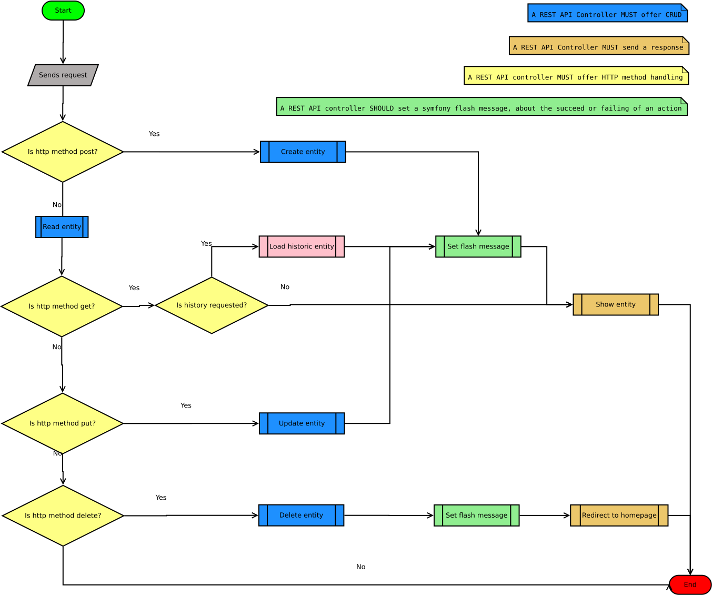

# REST API Controller
The controllers use the [FOSRestBundle](https://symfony.com/doc/master/bundles/FOSRestBundle/index.html).
## Workflow
The abstract workflow of the REST API controllers for a singular entity looks like this:

Special actions, e.g. lists are not shown in this diagram. This diagram also shows downstream procedures, to remember to implement them. Feel free to remove them from the diagram, as soon as they are documented somewhere else.
