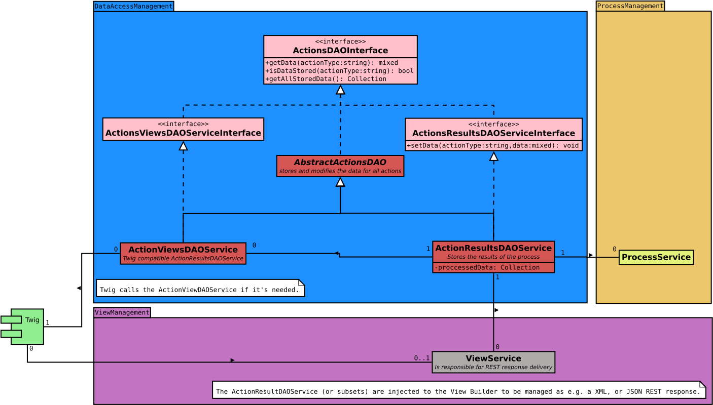

# Data Access Management
This folder containes [Data Access Objects (DAO)](https://de.wikipedia.org/wiki/Data_Access_Object).

## Abstract Actions DAO

### Action Results DAO
The Processed DAO containes the results which are generated by the process service.

### Action Views DAO
The View DAO translates makes the data of the ActionResultsDAOService accessible for twig.

## UML
This diagram shows the context in which the classes are working and existing:

