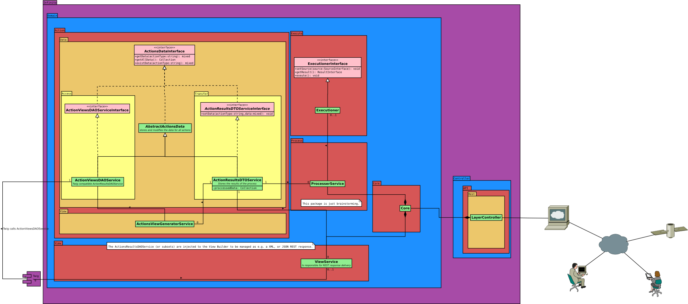

# Domain
This folder contains the [domain logic](https://en.wikipedia.org/wiki/Business_logic) of the application.

## Conventions
### Services
Classes which are optimized to be injected as a service MUST end on the suffix **Service.php**.
## Folders
A folder name SHOULD represent the [domain](https://de.wikipedia.org/wiki/Domain-driven_Design).

# Domain Overview

## Repository
### Layer Repository Factory Service
Offers a fabric to produce entity repositories by layer
## Entity
### Entity Meta Information ###
Offers some meta information about an entity

## Form
- FormMetaInformation

## Law
### LawPermissionChecker ###
Allows to check if a right has permission by a law.

## Member
### Member Manager ###
Allows to add and remove members and memberships from member relations.

## Path

### Namespace Path Map ###
Maps a path to a namespace.

## Request

Offers classes to manage requests for rights, users and sources. A [detailed description](./Request/README.md) is available.
## Right
### Right Checker ###
Checks if the crud, layer and source combination is granted by a right.
### Right Layer Combination Service ###
Allows to get the possible cruds for a layer, or the possible layers for a crud.
## Source
### Source Class Information Service ###
Offers to get all source classes, or source classes by a namespace.
### Source Member Information ###
Offers to get all source members over all dimensions.
### Source Member Manager
Offers to add and remove source members and memberships.
### Source Membership Information
Offers to get all memberships of a source.
### Source Right Manager
Allows to add and remove rights of a source.
### Tree Source Information
Allows to get branches and leaves of a tree.
## Template
### Template Path Management
Manages all informations which are needed to process templates.
## User
### User Source Director
Offers based on an user variable a user with a source.
### User Source Director Service
Offers the _user source director_ to be used as a service, based on the _entity manager_ and _security_.

## UML
This diagram shows the context in which the classes are working and existing:

