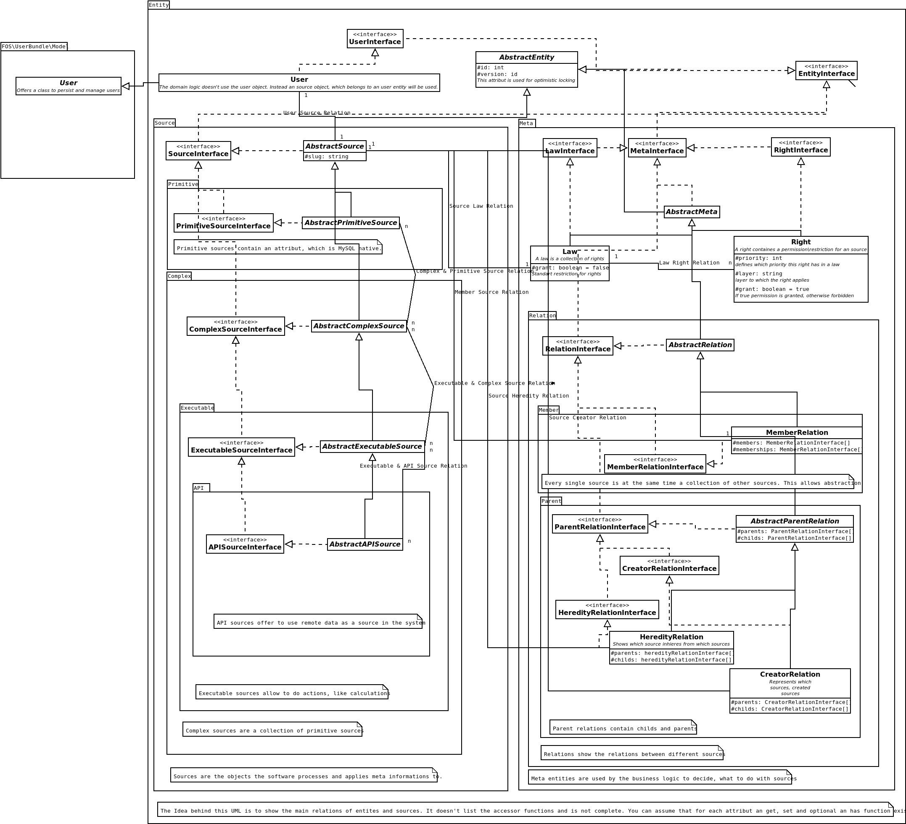

# Entity
This namespace uses [Doctrine ORM](https://www.doctrine-project.org/projects/doctrine-orm/en/2.6/reference/working-with-objects.html).

## UML
The following [UML diagram](https://de.wikipedia.org/wiki/Unified_Modeling_Language) shows on an abstract way how the entities are organized.

## See
Also check out the [Source README.md](Source/README.md).
